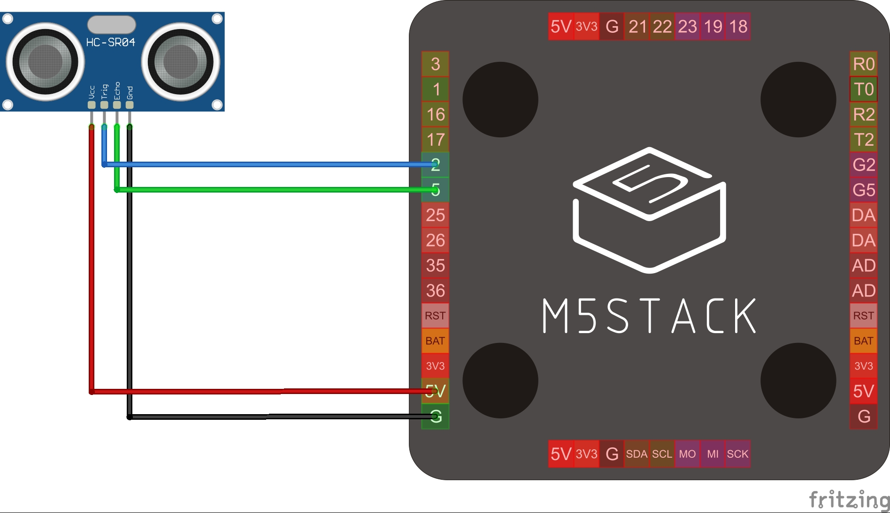

# M5Stackに超音波距離センサーを繋ぐ

* 実験の様子
  *   

* PCの画面
  * 

### 配線

* Vcc - 5V
* GND - GND
* TRIG - 2
* ECHO - 5

### できること
* M5Stack に、格安超音波距離センサー [HC-SR04](https://akizukidenshi.com/catalog/g/gM-11009/)を繋いで、測定値をLCDに表示する。
* シリアル通信で、PCにデータを送る。
* Processingでデータを受信して、測定値を画面に表示する。

### なんのための装置なの？
* 自由端反射をみたい

### なんでわざわざ自作したの？
* 教員が前で演示をするときに、測定値を大きく写したかったから。
* 連続測定をしたかったから。

### これがない時はどうやっていたの？
* 今までは、超音波距離測定器(例えば[これ](https://www.monotaro.com/g/04350011/?t.q=%92%B4%89%B9%94g%8B%97%97%A3%8Cv)とか)を使っていたが、いまいち盛り上がりに欠ける。